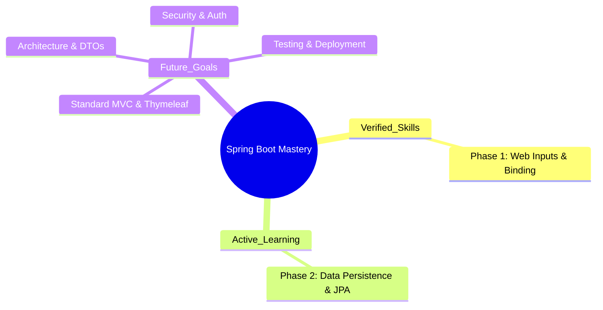

# Spring Boot Learning Sandbox ☕️🚀

> **A "No-Magic" approach to mastering Spring Boot.**

This repository documents my personal journey from Spring Boot basics to advanced architectural patterns. Unlike standard tutorials, this sandbox focuses on understanding the *internals*—moving beyond simple copy-pasting to deep comprehension of the "How" and "Why."

## 🗺️ The Learning Landscape

This project is built as a collection of **Modules**. While they build upon each other, the goal is to create a comprehensive reference for different parts of the Spring ecosystem.

## 📚 Module Progress

### ✅ Phase 1: Web Inputs & Data Binding
*Status: Completed*
Focuses on the REST Controller layer and how Spring maps HTTP requests to Java objects.
*   **Challenge 1:** Query Parameters (`@RequestParam`)
*   **Challenge 2:** Path Variables (`@PathVariable`)
*   **Challenge 3:** JSON Payloads & Jackson (`@RequestBody`)

### 🚧 Phase 2: Data Persistence
*Status: In Preparation*
Focuses on JPA, Hibernate internals, Entity lifecycles, and Database interactions.

### 🔮 Backlog (Planned Modules)
*   **Classic MVC:** Server-side rendering with Thymeleaf.
*   **Architecture:** Separation of concerns, DTO pattern, and Service layers.
*   **Advanced Topics:** Security, Custom Queries, and Performance tuning.

---

## 🛠️ Technology Stack
*   **Java 17** (LTS)
*   **Spring Boot 3**
*   **Maven**
*   **Spring Web**
*   **Jackson** (JSON Processing)
*   **H2 Database** (Upcoming)

## 🚀 How to Run
1.  Clone the repository.
2.  Open in IntelliJ IDEA or Eclipse.
3.  Run `SpringBootLearningSandboxApplication.java`.
4.  Use **Postman** to test the endpoints documented in each phase.

---
*Created by [Mohamed Yassine Ben Said]*
