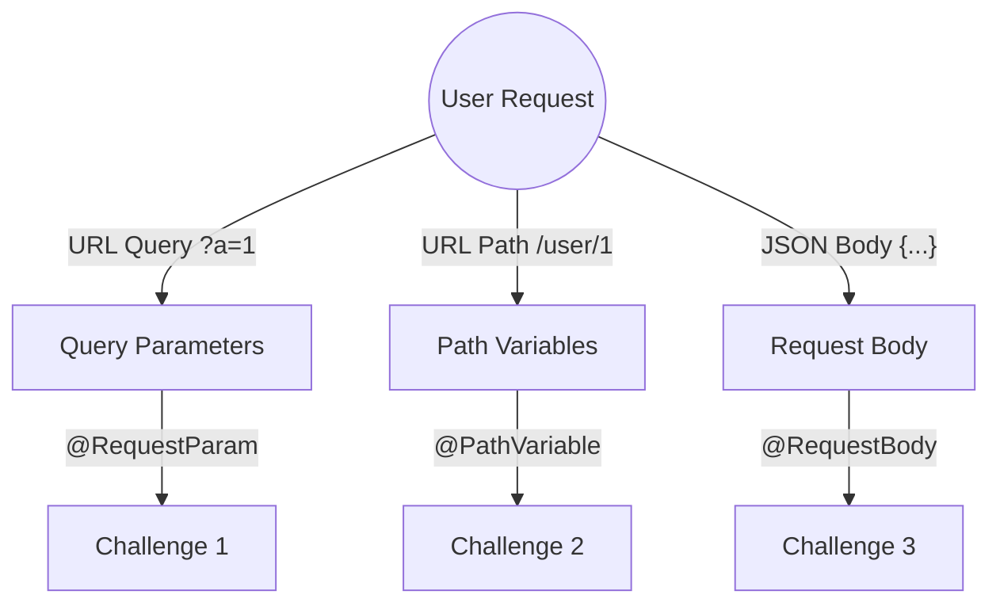

# Phase 1: Web Inputs & Data Binding 🕸️

**Goal:** Master the art of capturing user data from HTTP requests and binding them to Java variables.

In this phase, we explore the three fundamental ways Spring Boot creates bridges between the **Client** (Browser/Postman) and the **Server** (Java).

## 🗺️ The Landscape
Spring Boot provides specific annotations to handle different parts of an HTTP Request.

## 🧠 Key Concepts Learned
| Concept | Annotation | Use Case | Analogy |
| :--- | :--- | :--- | :--- |
| **Query Params** | `@RequestParam` | Filtering, Sorting, Search | Searching Google (`?q=java`) |
| **Path Variables** | `@PathVariable` | Identifying a specific resource | File folders (`/photos/2023`) |
| **Request Body** | `@RequestBody` | Sending complex data (Forms, Objects) | Mailing a package 📦 |

---
*Navigate to the sub-folders to see the code and specific details for each challenge.*
