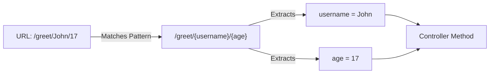

# Challenge 2: Path Variables 🛣️

**Topic:** Handling dynamic data embedded in the URL path.
**Annotation:** `@PathVariable`

## 📝 The Concept
In modern REST APIs, we treat data as **Resources**. The ID or name of the resource becomes part of the URL structure itself, rather than a tacked-on parameter.

### 🌊 Data Flow
Spring uses `{curly_braces}` in the mapping to define "wildcards".



## 💻 The Code
**GreetingController.java**

```java
@GetMapping("/{username}/{age}")
public String greet(
        @PathVariable String username, 
        @PathVariable int age
) {
    // Logic: Check age to determine message
    return (age < 18) 
        ? "Hello " + username + ", you are too young!" 
        : "Welcome " + username + ", come on in!";
}
```

### 🧪 How to Test
*   **URL:** `http://localhost:8080/challenge2/greet/Mario/25`
*   **Expected Output:** `Welcome Mario, come on in!`
