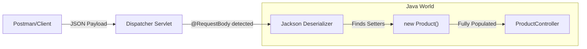

# Challenge 3: Request Body & JSON 📦

**Topic:** Sending complex objects using POST requests.
**Annotation:** `@RequestBody`
**Engine:** Jackson Library

## 📝 The Concept
URLs have length limits. To send complex data (like a Product with price, name, and stock status), we use the **Body** of the HTTP request. We send data as **JSON**, and Spring converts it to a Java Object.

### ⚙️ Under the Hood: The Jackson Magic
We do not manually parse the JSON. A library called **Jackson** (included in Spring Boot) does the heavy lifting.



> **⚠️ Critical Rule:** The `Product` class **MUST** have Getter and Setter methods. Jackson uses the Setters (e.g., `setPrice()`) to inject the values from the JSON.

## 💻 The Code

**Product.java (The Model)**
```java
public class Product {
    private String name;
    private double price;
    private boolean inStock;
    // Getters and Setters are hidden here, but REQUIRED!
}
```

**ProductController.java**
```java
@PostMapping
public String createProduct(@RequestBody Product product) {
    // 'product' is already a Java object here!
    return (product.getPrice() < 0) 
        ? "Error: Price cannot be negative" 
        : "Product " + product.getName() + " created successfully with price " + product.getPrice();
}
```

### 🧪 How to Test (Postman Required)
1.  **Method:** `POST`
2.  **URL:** `http://localhost:8080/challenge3/products`
3.  **Body (Raw -> JSON):**
    ```json
    {
        "name": "Super Laptop",
        "price": 1500.00,
        "inStock": true
    }
    ```