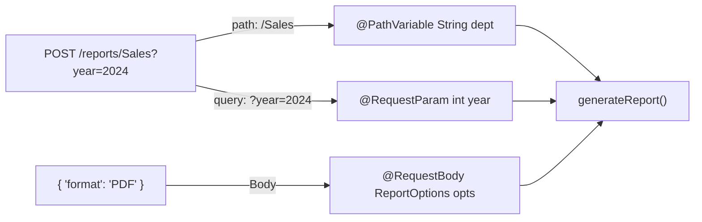

# Final Boss: The Dashboard Search 🎮

**Topic:** Combining all Data Binding techniques in one request.

## 🎯 The Challenge
Build an endpoint that accepts:
1.  **Department** via URL Path (`@PathVariable`)
2.  **Year** via Query Param (`@RequestParam`)
3.  **Report Options** via JSON Body (`@RequestBody`)

## 🌊 Data Flow Visualization



## 🧪 How to Test
*   **Method:** `POST`
*   **URL:** `http://localhost:8080/phase1/dashboard/reports/IT?year=2023`
*   **Body (JSON):**
    ```json
    {
        "adminName": "Yassine",
        "format": "EXCEL"
    }
    ```
