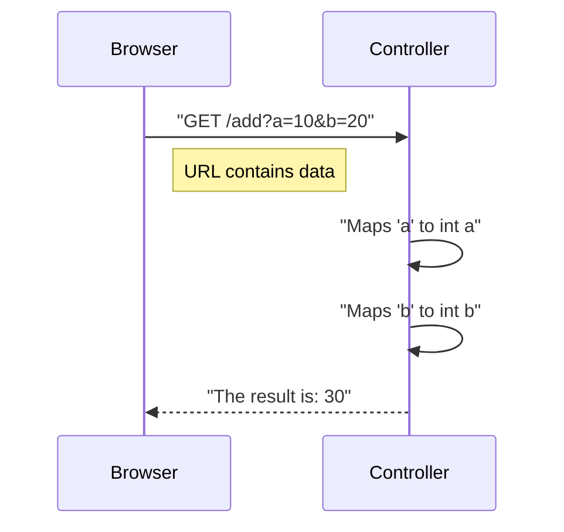

# Challenge 1: Query Parameters 🔍

**Topic:** Handling data sent via the URL query string.
**Annotation:** `@RequestParam`

## 📝 The Concept
Query parameters are key-value pairs added to the end of a URL after a `?` symbol. They are traditionally used for optional filters or simple data transfer.

### 🌊 Data Flow
The user explicitly names the variables (`a` and `b`) in the URL, and Spring maps them to the method arguments.



## 💻 The Code
**CalculatorController.java**

```java
@GetMapping("/add")
public String add(@RequestParam int a, @RequestParam int b) {
    // Spring automatically converts the String "10" from URL to int 10
    return "The result is: " + (a + b);
}
```

### 🧪 How to Test
*   **URL:** `http://localhost:8080/challenge1/calculator/add?a=50&b=50`
*   **Expected Output:** `The result is: 100`
