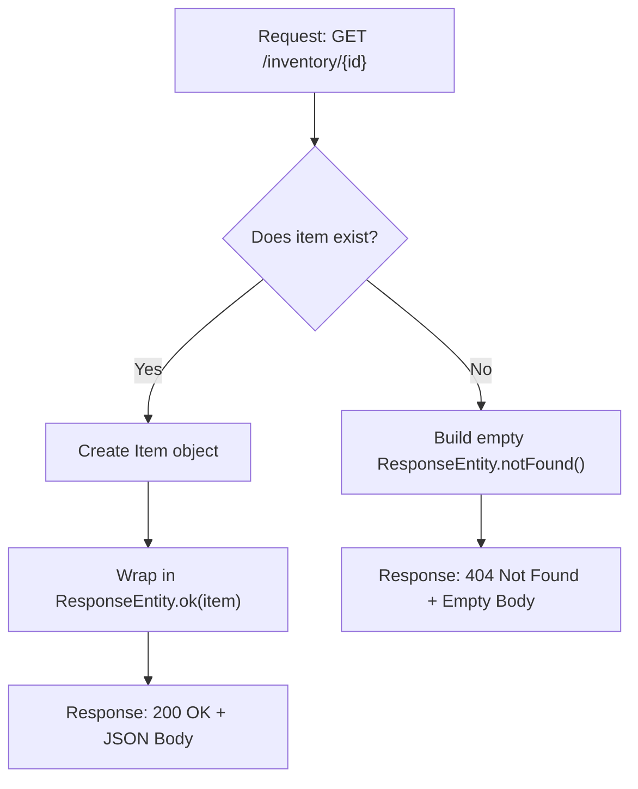

# Challenge 5: Professional Responses with ResponseEntity 📮

**Topic:** Gaining full control over the HTTP Response (Status Codes, Headers, and Body).
**Mechanism:** The `ResponseEntity<T>` wrapper class.

## 🧐 The Problem
Returning a plain Java object (`Item` or `List<Item>`) is convenient, but it has major limitations:
1.  **The Status is always `200 OK`:** We can't signal that a resource was `Created` (201) or `Not Found` (404).
2.  **No Error Body:** If an item isn't found, we return `null`, which results in an empty response body. The client has no idea *why* it's empty.
3.  **No Custom Headers:** We can't add custom information like authentication tokens or pagination details to the response headers.

## 🛠️ The Solution: `ResponseEntity`
`ResponseEntity` is a wrapper that holds the entire HTTP response. By using it as our return type, we can configure everything manually.

### 🌊 The Flow: Success vs. Failure



## 💻 The Code

### A) Handling Success (200 OK) and Failure (404 Not Found)
By changing the return type to `ResponseEntity<Item>`, we can return different types of responses from the same method.

```java
// InventoryController.java

@GetMapping("/{id}")
public ResponseEntity<Item> getItem(@PathVariable int id) {
    if (id == 101) { // Simulate finding the item
        Item foundItem = new Item(101, "Mechanical Keyboard", 50);
        // Use the .ok() builder for a 200 response
        return ResponseEntity.ok(foundItem);
    } else { // Simulate not finding it
        // Use the .notFound() builder for a 404 response
        return ResponseEntity.notFound().build();
    }
}
```

### B) Handling Creation (201 Created)
When creating a new resource, the standard is to return a `201 Created` status.

```java
// InventoryController.java

@PostMapping
public ResponseEntity<Item> createItem(@RequestBody Item item) {
    // Simulate saving the item...
    System.out.println("Saved item: " + item.getName());

    // Use .status() or the .created() builder for a 201 response
    return ResponseEntity.status(HttpStatus.CREATED).body(item);
}
```