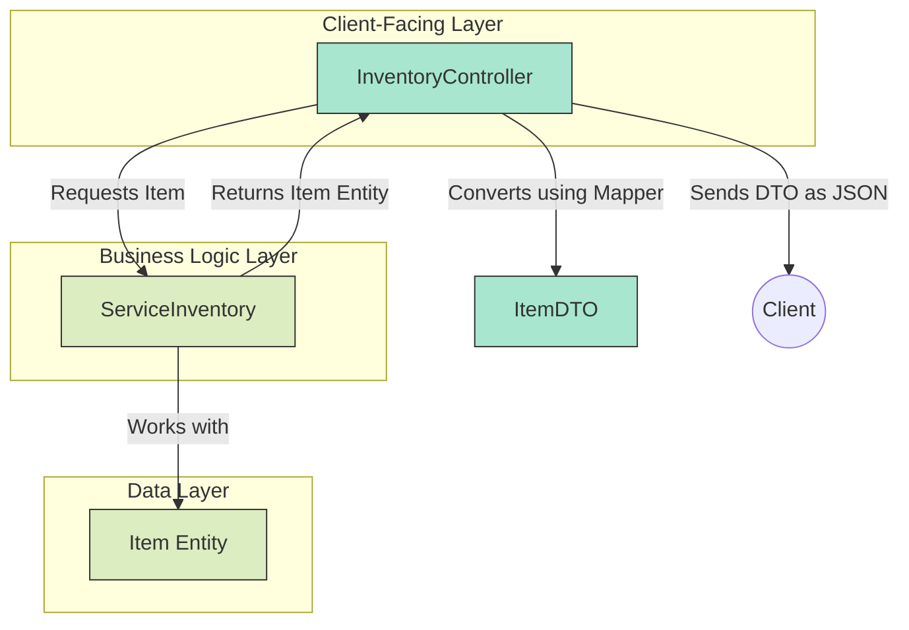

# Challenge 7: The DTO (Data Transfer Object) Pattern 🎭

**Topic:** Separating the internal data model (Entity) from the public API model (DTO).
**Mechanism:** Creating dedicated DTO classes and Mappers.

## 🧐 The Problem: Exposing Your Secrets
In the previous challenge, our Service and Controller both used the same `Item` class. This is dangerous and inflexible in a real application.

1.  **Security Leaks:** What if our `Item` entity had a field like `internalCost` or `supplierId`? By returning the `Item` object directly, we would accidentally expose sensitive internal data to the public.
2.  **API Brittleness:** If we need to rename a field in our database entity (e.g., `quantity` -> `stockCount`), we would break our public API contract, forcing all clients (mobile apps, websites) to update.
3.  **Complex Logic:** The API might need a computed field (like a "status") that doesn't exist in the database. Adding this logic to the entity class pollutes its primary purpose.

> **Analogy:** The **Entity** (`Item`) is your private, detailed diary. The **DTO** (`ItemDTO`) is your public-facing social media profile. You only share what is necessary and appropriate for the public.

## 🛠️ The Solution: The DTO & The Mapper
We create a clear boundary between our internal world and the public API.

1.  **The DTO (`ItemDTO`):** A plain Java object that defines the **public shape** of our data. It contains only the fields the client needs to see.
2.  **The Mapper (`fromEntity`):** A converter function that translates an internal `Item` entity into a public `ItemDTO`. This is where we can add logic, format data, and hide sensitive fields.

### 🌊 The New Architecture



## 💻 The Code

### ItemDTO.java (The "Public Face")
Note how it has a `status` string, not an integer `quantity`.

```java
public class ItemDTO {
    private int id;
    private String name;
    private String status;
    // Getters and Setters...

    // The Mapper Logic
    public static ItemDTO fromEntity(Item item) {
        ItemDTO dto = new ItemDTO();
        dto.setId(item.getId());
        dto.setName(item.getName());

        // Business logic lives here!
        if (item.getQuantity() > 10) {
            dto.setStatus("In Stock");
        } else {
            dto.setStatus("Low Stock");
        }
        
        return dto;
    }
}
```

### InventoryController.java (The "Translator")
The controller's return type is now `ResponseEntity<ItemDTO>`. It's responsible for the final conversion before sending the response.

```java
@GetMapping("/{id}")
public ResponseEntity<ItemDTO> getItem(@PathVariable int id) {
    Item foundItem = service.getItemById(id); // Service returns the internal entity
    
    if (foundItem != null) {
        // Convert the entity to a DTO for the public response
        ItemDTO dto = ItemDTO.fromEntity(foundItem);
        return ResponseEntity.ok(dto);
    } else {
        return ResponseEntity.notFound().build();
    }
}
```

---
**Key Takeaway:** Services work with internal **Entities**. Controllers speak the public language of **DTOs**. The Mapper is the translator between them.
