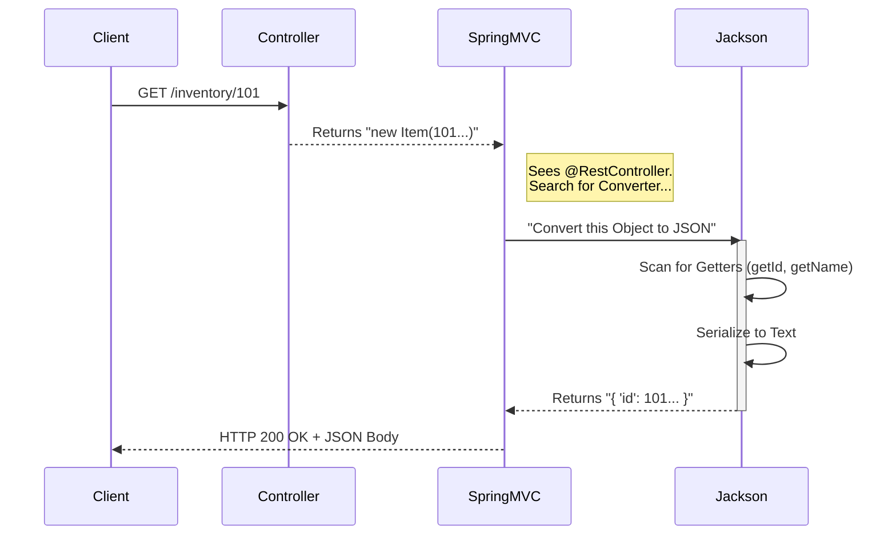

# Challenge 4: Output Serialization (Java → JSON) 📤

**Topic:** Returning complex Java Objects and Lists as API responses.
**Mechanism:** Serialization via Jackson.

## 🧐 The Mystery
In previous challenges, we returned `String`.
In this challenge, we wrote:
```java
public Item getItem() { return new Item(101, "Mouse", 50); }
```
We returned a **Java Object** (which lives in the heap memory). Yet, Postman received **JSON Text**.
We never wrote `item.toJsonString()`. **Who did the conversion?**

## ⚙️ Under the Hood: The "Message Converter" Chain

When a Controller method returns a value, Spring Boot starts a specific decision process:

### 1. The Trigger: `@RestController`
You used `@RestController` on the class. This is a **Stereotype Annotation**. It is actually two annotations combined:
```java
@Controller      // Registers class as a Spring Bean
@ResponseBody    // <--- THE MAGIC SWITCH
```
*   **Without `@ResponseBody`:** Spring assumes the return string is a **View Name** (like `index.html`) and tries to find a template file (Thymeleaf/JSP).
*   **With `@ResponseBody`:** Spring knows the return value is **Data**. It must be written directly into the HTTP Response Body.

### 2. The Engine: `HttpMessageConverter`
Spring knows it needs to write "Data," but it doesn't know *how* to convert a `List<Item>` into text. It asks its **Message Converters**.

1.  **Classpath Scanning:** When you added `spring-boot-starter-web` to `pom.xml`, it downloaded the **Jackson** library.
2.  **Auto-Configuration:** On startup, Spring Boot detected Jackson on the classpath. It automatically registered a `MappingJackson2HttpMessageConverter`.
3.  **Negotiation:**
    *   Spring sees you are returning `Item`.
    *   Spring sees the request accepts `application/json`.
    *   Spring asks Jackson: *"Can you convert `Item` to JSON?"*
    *   Jackson says: *"Yes."*

### 3. The Execution: Jackson & Getters
Jackson takes the object and uses **Reflection**.
*   It looks for public methods starting with `get`.
*   It finds `getName()`. It extracts "name" as the JSON key and the return value as the value.
*   **Crucial:** If `Item` had no Getters, Jackson would produce an empty JSON object `{}` or throw an error.

## 🌊 The Flow Diagram



## 💻 The Code

**InventoryController.java**
```java
@GetMapping
public List<Item> getItems() {
    // We return Java List. Spring + Jackson handles the rest.
    return List.of(
        new Item(101, "Keyboard", 50), 
        new Item(102, "Mouse", 20)
    );
}
```

### 🧪 How to Test
*   **Method:** `GET`
*   **URL:** `http://localhost:8080/phase2/inventory`
*   **Result:** A JSON Array `[ ... ]`.

---
**Key Takeaway:** You handle the **Object**, Spring handles the **Format**.
