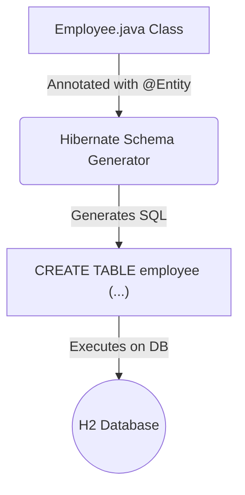

# Challenge 1: The @Entity and @Repository 🏛️

**Topic:** Mapping a Java class to a database table and creating a data access layer.
**Mechanisms:** JPA Annotations (`@Entity`, `@Id`) and Spring Data (`JpaRepository`).

## Part A: The `@Entity`
This is the process of teaching Hibernate how to represent our `Employee` class as a SQL table.

### 📝 The Concept
We use annotations from `jakarta.persistence` to add metadata to our class. Hibernate reads this metadata on startup and automatically generates the `CREATE TABLE` SQL statement.



### 💻 The Code
Key annotations are used to define the table structure.

```java
import jakarta.persistence.*;

@Entity // 1. Marks this class as a database entity.
public class Employee {

    @Id   // 2. Specifies this field is the Primary Key.
    @GeneratedValue(strategy = GenerationType.IDENTITY) // 3. The DB will auto-increment the ID.
    private Long id;

    private String firstName;
    //...

    // 4. A no-arg constructor is REQUIRED by JPA.
    public Employee() {}
    
    //... Getters, Setters, etc.
}
```

## Part B: The `@Repository`
This is the "magic" of Spring Data JPA. We get a fully functional data access object without writing any implementation code.

### 📝 The Concept
We create an `interface` that extends `JpaRepository`. This is a generic interface that needs two pieces of information:
1.  The Entity type it manages (`Employee`).
2.  The data type of that entity's Primary Key (`Long`).

At runtime, Spring automatically creates a bean that implements this interface with all the standard CRUD (Create, Read, Update, Delete) methods.

### 💻 The Code
The interface itself is empty. The power comes from the `extends` keyword.

```java
import org.springframework.data.jpa.repository.JpaRepository;
import org.springframework.stereotype.Repository;

@Repository
public interface EmployeeRepository extends JpaRepository<Employee, Long> {
    // Spring Data JPA provides the implementation for methods like:
    // .save(Employee e)
    // .findById(Long id)
    // .findAll()
    // .deleteById(Long id)
    // ...and many more!
}
```

---
**Key Takeaway:** `@Entity` defines the **"What"** (the data structure). `JpaRepository` provides the **"How"** (the data operations).

---

## Part C: Advanced Derived Queries
The power of `JpaRepository` goes far beyond simple `findById`. We can create complex queries just by following a specific naming convention for our methods. Spring Data JPA parses the method name and translates it into a SQL `WHERE` clause.

### 📝 The Concept: The "Language" of Method Names
The pattern `findBy<FieldName><Keyword>` allows for a rich set of operations.

| Keyword | SQL Equivalent | Example Method Name |
| :--- | :--- | :--- |
| (None) | `WHERE department = ?` | `findByDepartment(String dept)` |
| `Containing`| `WHERE lastName LIKE ?` | `findByLastNameContaining(String str)`|
| `GreaterThan` | `WHERE id > ?` | `findByIdGreaterThan(Long id)` |
| `And` / `Or`| `... AND ...` / `... OR ...` | `findByDepartmentAndLastName(...)`|
| `IgnoreCase`| `UPPER(lastName) LIKE UPPER(?)`| `findByLastNameContainingIgnoreCase(...)`|

### 💻 The Code
We can add these new method signatures directly to our `EmployeeRepository` interface. No implementation is needed!

**EmployeeRepository.java**
```java
public interface EmployeeRepository extends JpaRepository<Employee, Long> {
    
    // Basic query from Part B
    List<Employee> findByDepartment(String department);

    // --- ADVANCED QUERIES ---

    // Finds employees whose last name contains the given string
    List<Employee> findByLastNameContaining(String infix);

    // Finds employees whose ID is greater than a certain number
    List<Employee> findByIdGreaterThan(Long startingId);

    // Combines two fields with a logical AND
    List<Employee> findByDepartmentAndLastNameContaining(String department, String infix);
}

