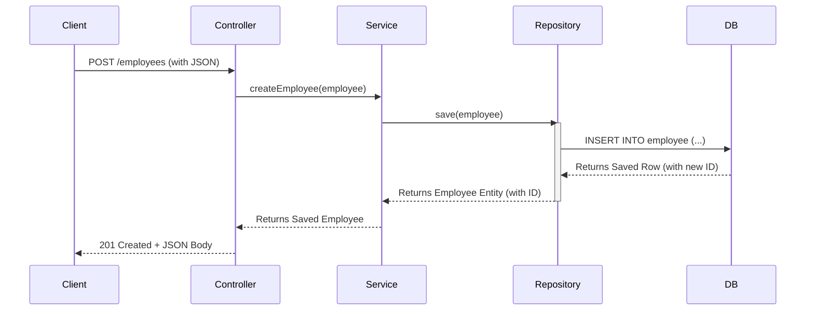

# Challenge 2: The Full CRUD API Integration 🚀

**Topic:** Connecting the Controller, Service, and Repository to create a fully functional API that interacts with a database.

## 📝 The Concept
This challenge brings together everything we have learned so far. We assemble our three-layer architecture to handle real data, replacing our old "hardcoded" logic with live database calls.

### 🌊 The Data Flow (POST Request)
This diagram shows the complete journey of creating a new employee.



## 💻 The Code

### EmployeeService.java
The service now **injects the repository** and uses its methods to interact with the database. The fake `if/else` logic is gone forever.

```java
@Service
public class EmployeeService {
    private final EmployeeRepository repo;

    public EmployeeService(EmployeeRepository repo) {
        this.repo = repo;
    }

    public Employee createEmployee(Employee employee) {
        // Delegate to the repository's save method
        return repo.save(employee);
    }

    public Optional<Employee> findEmployeeById(long id) {
        // Delegate to the repository's findById method
        return repo.findById(id);
    }
}
```

### EmployeeController.java
The controller remains clean and delegates to the service, exactly as before.

```java
@RestController
@RequestMapping("/employees")
public class EmployeeController {
    private final EmployeeService service;
    // ... constructor injection ...

    @PostMapping
    public ResponseEntity<Employee> createEmployee(@RequestBody Employee employee) {
        Employee savedEmployee = service.createEmployee(employee);
        return ResponseEntity.status(HttpStatus.CREATED).body(savedEmployee);
    }
}
```

---
**Key Takeaway:** By replacing the hardcoded service logic with repository calls, our application now has a persistent **memory**.
